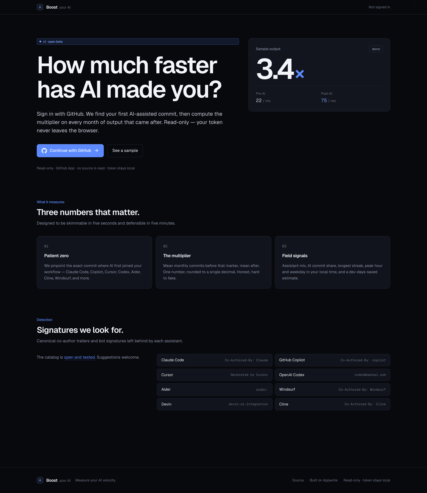
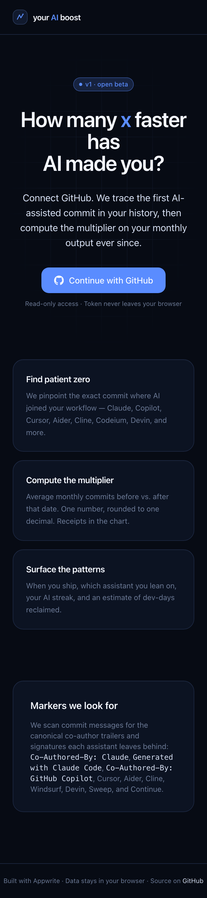
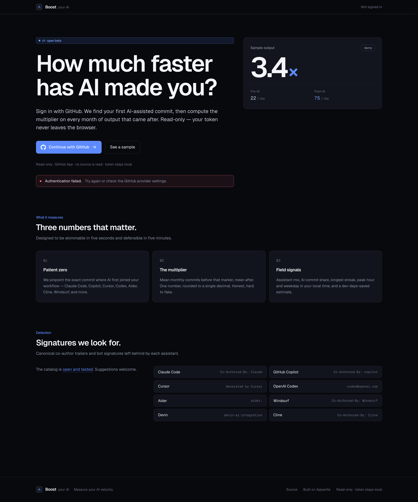
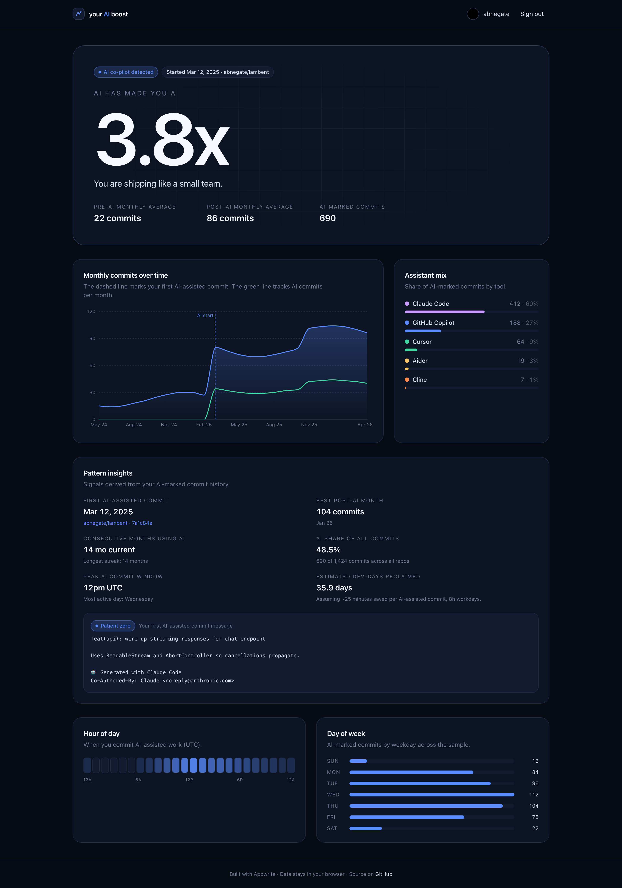
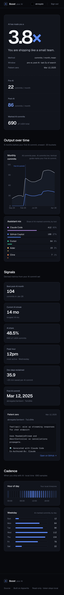
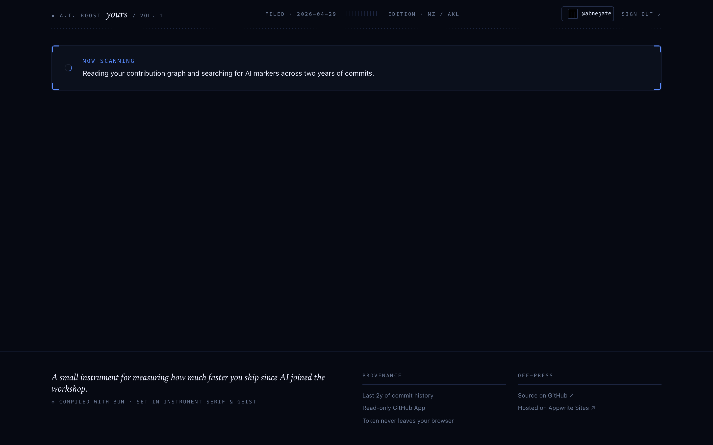
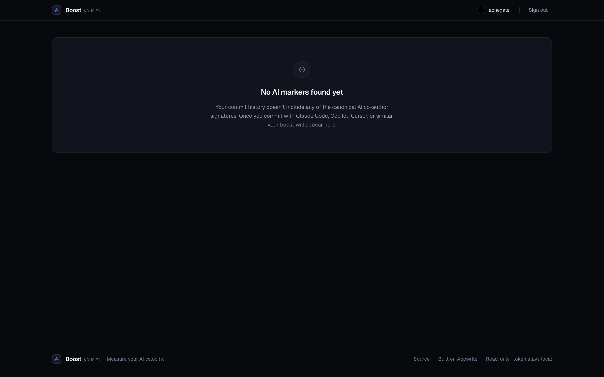
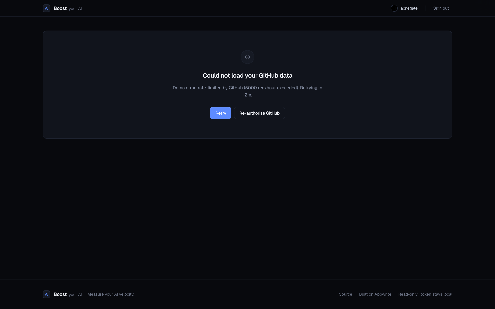
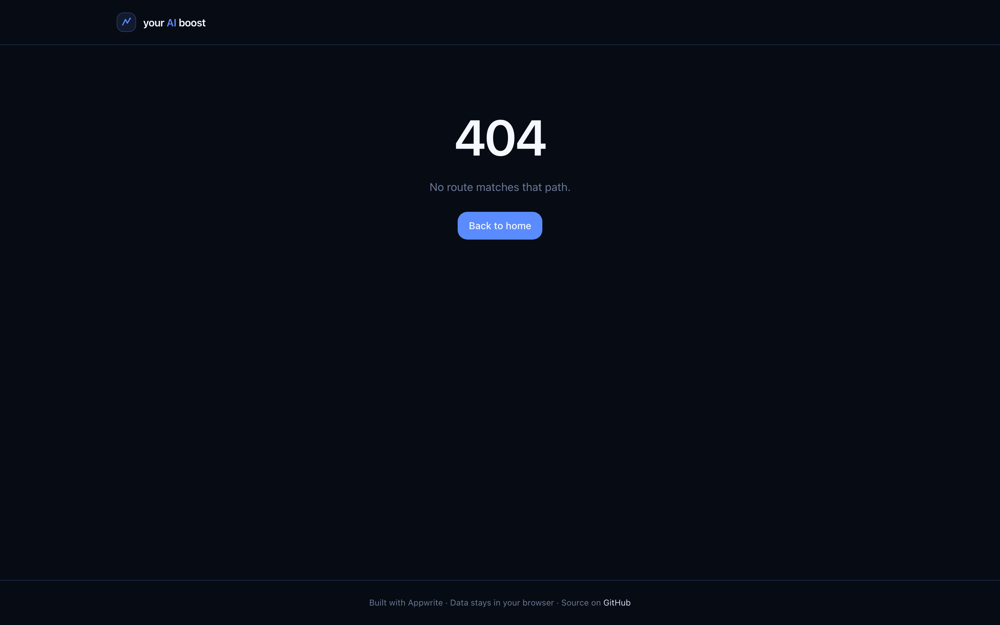

# your AI boost

How many `x` faster has AI made you? Connect GitHub, get a multiplier on your monthly commit output and a breakdown of your AI coding patterns.

## Screenshots

Every screen state below was captured by Playwright against the actual built app. Source under [`docs/screenshots/`](./docs/screenshots).

### Landing





### Dashboard







### 404



## Stack

- **Runtime / package manager / bundler / test runner:** Bun 1.3
- **UI:** React 19 with `react-router` 7, TanStack Query 5, Recharts 3
- **Styling:** Tailwind CSS v4 (CSS-first `@theme` tokens, compiled via `@tailwindcss/cli`)
- **Auth:** Appwrite Web SDK 25 → **GitHub App** (not classic OAuth App) with `contents: read` + `metadata: read` only. No write access anywhere.
- **GitHub data:** Octokit (REST + GraphQL)
- **TypeScript:** strict, `verbatimModuleSyntax`, `noUncheckedIndexedAccess`, `noImplicitOverride`, `erasableSyntaxOnly`
- **Tests:** `bun test` against pure-domain modules (analyzer + markers + format) — 25 tests, 84 expectations

## Local development

```bash
bun install
cp .env.example .env
bun run dev
```

Required env (`.env`):

```
PUBLIC_APPWRITE_ENDPOINT=https://syd.cloud.appwrite.io/v1
PUBLIC_APPWRITE_PROJECT_ID=69f167e7001144ec353a
```

`bunfig.toml` exposes any `PUBLIC_*` env var to the client bundle (both dev and build).

### Scripts

| Command | What it does |
| --- | --- |
| `bun run dev` | Bun.serve dev server with HTML routes + Tailwind in `--watch` |
| `bun run build` | Compiles Tailwind, then `Bun.build` produces `dist/` (HTML, JS, CSS, assets) |
| `bun run preview` | Serves `dist/` from a local Bun server |
| `bun test` | Runs all `*.test.ts` via `bun test` |
| `bun run lint` | ESLint flat config (`@eslint/js`, `typescript-eslint`, `react-hooks`) |
| `bun run typecheck` | `tsc --noEmit` |
| `bun run screenshots` | Captures every screen state to `docs/screenshots/` (requires dev server running) |

### Demo mode

The dashboard accepts a `?demo=` query string for screenshots and design review without real auth:

| URL | Renders |
| --- | --- |
| `/dashboard?demo=ready` | Full dashboard with seeded analysis |
| `/dashboard?demo=loading` | Scanning state |
| `/dashboard?demo=empty` | "No AI markers found yet" |
| `/dashboard?demo=error` | Failure card with retry |

## How it works

1. **Sign in with GitHub** via Appwrite OAuth — `read:user` scope only.
2. **Find patient zero**: search the user's **public** commits for canonical AI markers (Claude Code, Copilot, Cursor, Aider, Cline, Codeium/Windsurf, Devin, Sweep, Continue) and pick the earliest.
3. **Compute the multiplier**: average monthly commits before vs. after that date, using `viewer.contributionsCollection` (which counts both public and private contributions toward the daily totals — without granting us access to private code). Result rounded to 1 decimal.
4. **Surface insights**: assistant mix, AI commit share, longest streak, peak hour / weekday, dev-days reclaimed, and the original "patient zero" commit message.

### Why a GitHub App (not an OAuth App)

GitHub's classic `repo` OAuth scope is read+write to all repo data: code, issues, PRs, wikis, settings, webhooks, deploy keys, collaboration invites. There is no read-only equivalent in classic OAuth scopes — it's `repo` (everything) or nothing.

GitHub Apps let you request only `contents: read` (commit metadata + file contents) and `metadata: read`. So that's what we use. The consent screen the user sees lists exactly two read-only permissions, no write access, no settings access.

To register the GitHub App for a fresh deploy, run `bun run create-github-app`. The script spins up a localhost callback, opens GitHub's manifest-confirmation page, captures the resulting `client_id`/`client_secret` automatically, and tells you exactly where to paste them in Appwrite.

All GitHub data is fetched directly from the user's browser using the OAuth access token returned by Appwrite — nothing is persisted server-side by this app.

## Deployment

Deployed via **Appwrite Sites** with GitHub as the source. Push to `main` triggers a build (`bun run build`) and serves `dist/`. See [`DEPLOYMENT.md`](./DEPLOYMENT.md) and [`appwrite.config.json`](./appwrite.config.json) for the full configuration.
